# TeleDrive - Cloud Storage via Telegram 📦

A comprehensive cloud storage solution that leverages Telegram's infrastructure for file storage and management. Upload, organize, and access your files from anywhere using Telegram as the backend storage service.

## 📜 Overview

TeleDrive is a full-stack application that transforms Telegram into your personal cloud storage system. The project consists of a Flutter frontend and a Node.js backend that acts as an intermediary between the application and Telegram's API. This enables users to securely store and manage their files through a familiar and intuitive interface.

---
## 📸 Application Screenshots

1. **Login Screen** 🔒  
   The login screen using Telegram authentication to securely access your drive.  
   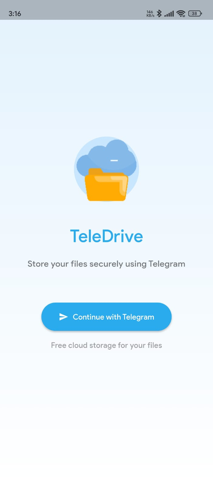

2. **Home Page - All Files** 🏠  
   Main dashboard showing all files with search and upload functionality.  
   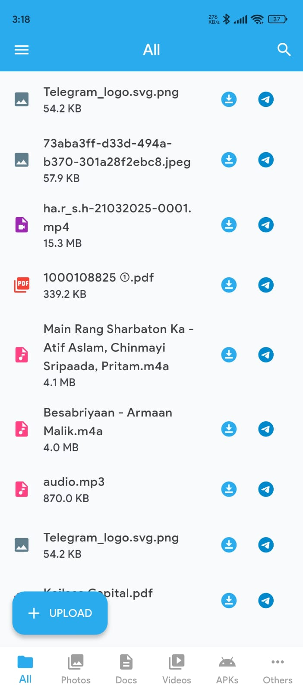  
   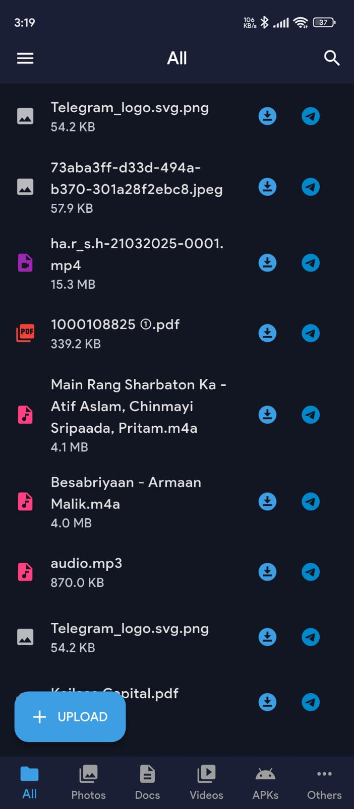

3. **Photos Gallery** 📸  
   Grid view of all images with thumbnail previews for quick browsing.  
   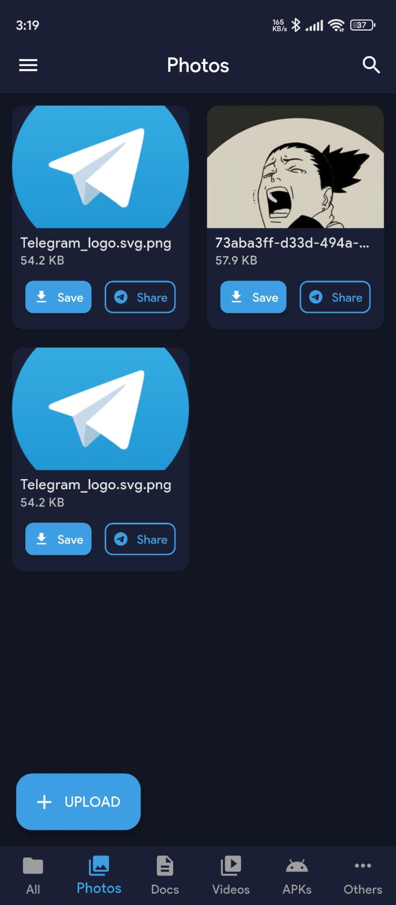

4. **Documents Section** 📜  
   Organized view of document files with type indicators and quick actions.  
   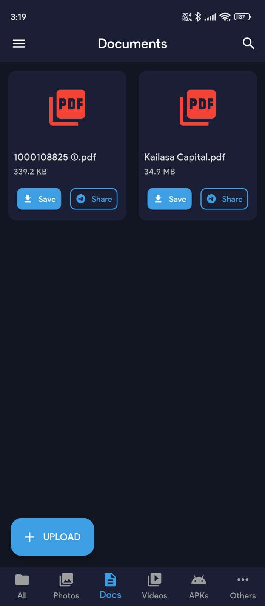

5. **Video Gallery** 🎥  
   Built-in video player for previewing video content directly in the app.  
   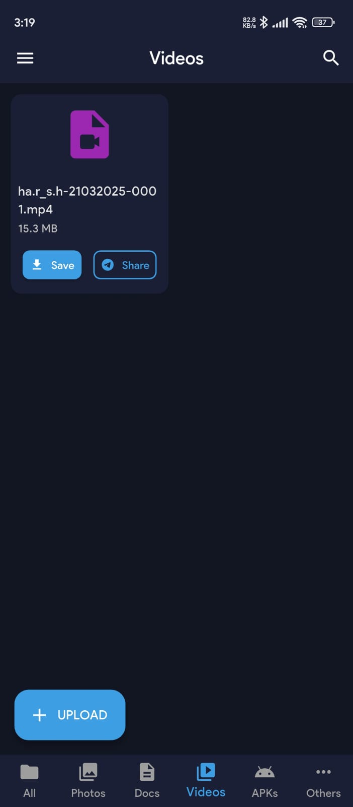

6. **File Upload** ⬆️  
   File selection and upload interface with progress tracking.
   
7. **Downloads Manager** 🔽️  
   List of files downloaded to the device with open and share options.  
   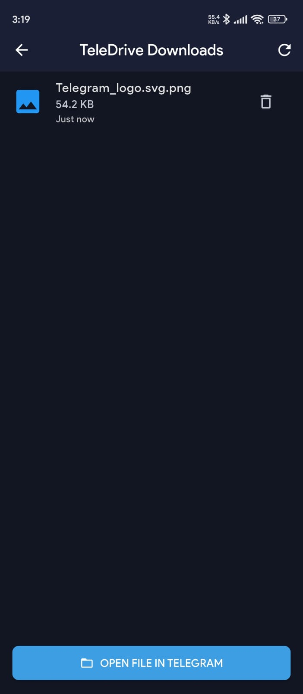

8. **Recycle Bin** 🗑️  
   Deleted files with options to restore or permanently remove.  
   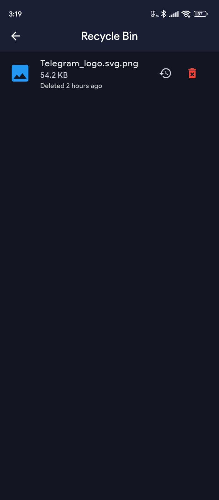


### Additional Screenshots

* **App Navigation Drawer**  
  Easy access to all app sections from any screen.  
  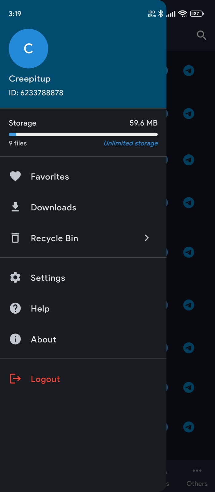

* **Other Files Section**  
  View and manage miscellaneous file types.  
  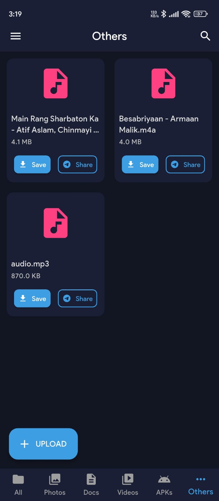

* **Successful Authentication**  
  Confirmation screen after successful login.  
  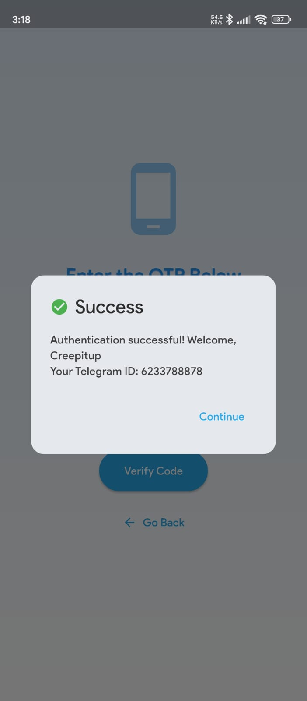

---
## 🚀 Features

### User Experience 👤

* **Secure Authentication:** Login using Telegram's authentication system 🔒
* **Intuitive Interface:** User-friendly design for easy file management 🎨
* **Cross-platform Support:** Works on Android, iOS, and web platforms 📱💻

### File Management 📂

* **Upload & Download:** Transfer files to and from Telegram's servers ⬆️🔽️
* **File Categories:** Automatic organization into Photos, Documents, Videos, APKs, and Others 📸📜🎥
* **Search Functionality:** Easily find files by name 🔍
* **File Preview:** Preview images and documents directly in the app 👀

### Storage Features 📀

* **Recycle Bin:** Soft-delete functionality with restore capability 🗑️
* **Direct Downloads:** Save files directly to device storage 📅
* **Telegram Forwarding:** Send files to your Telegram chat 📤
* **File Status Tracking:** Monitor upload and download progress 📊

### Technical Features 🛠️

* **Thumbnail Generation:** Automatic thumbnail creation for image files 🖼️
* **Permission Handling:** Proper storage access permissions 🔐
* **Error Handling:** Robust error management for a smooth user experience 🚨
* **Responsive Design:** Works seamlessly across different screen sizes 🔏

---

## 🔧 Tech Stack

### Frontend 🌐

* **Flutter:** Cross-platform UI framework for building natively compiled applications 🖥️
* **Dart:** Programming language optimized for building UIs 🐧
* **HTTP Package:** For API communication with backend 🌍
* **File Management Libraries:** For handling file operations on the device 📁

### Backend ⚙️

* **Node.js:** JavaScript runtime environment for server-side code 🟢
* **Express:** Web application framework for Node.js 🚀
* **Telegram Bot API:** For file storage and retrieval 🤖
* **Multer:** For handling file uploads 📤

---

## 🖥️ Installation & Setup

### Prerequisites 📋

* **Flutter SDK (2.0+)** 🖼️
* **Node.js (14.0+)** 🟢
* **Telegram Bot Token** (from @BotFather) 🤖

### Frontend Setup 🌟

1. **Clone the repository:**

   ```bash
   git clone https://github.com/yourusername/telegram_drive
   ```
2. **Navigate to the frontend directory:**

   ```bash
   cd telegram_drive/frontend
   ```
3. **Install dependencies:**

   ```bash
   flutter pub get
   ```
4. **Run the application:**

   ```bash
   flutter run
   ```

### Backend Setup ⚙️

1. **Navigate to the backend directory:**

   ```bash
   cd telegram_drive/backend
   ```
2. **Install dependencies:**

   ```bash
   npm install
   ```
3. **Create a `.env` file with the following content:**

   ```
   TELEGRAM_BOT_TOKEN=your_telegram_bot_token_here
   PORT=3000
   ```
4. **Start the server:**

   ```bash
   npm start
   ```

---

## 🌐 API Endpoints

### Authentication 🔒

* **POST** `/api/verify` - Verify the 6-digit code received from Telegram bot

### File Management 📁

* **POST** `/api/upload` - Upload a file to Telegram ⬆️
* **GET** `/api/files` - Get all files for a user 📋
* **GET** `/api/file/:fileId` - Download a file directly 📅
* **GET** `/api/download/:fileId` - Send a file to user's Telegram chat 📤
* **DELETE** `/api/file/:fileId` - Move a file to the Recycle Bin 🗑️

### Thumbnails 🖼️

* **GET** `/api/thumbnail/:fileId` - Get thumbnail for an image file

### Recycle Bin 🗑️

* **GET** `/api/bin` - List files in recycle bin 📋
* **POST** `/api/bin/restore/:fileId` - Restore a file from recycle bin 🔄
* **DELETE** `/api/bin/:fileId` - Permanently delete a file ❌
* **DELETE** `/api/bin/empty` - Empty the recycle bin 🧹

---

## 📂 Project Structure

### Frontend 🌟

```
frontend/
├── lib/
│   ├── constants.dart    # App-wide constants including entry point of the app
│   ├── main.dart        # Entry point of the application
│   ├── home/            # Home page and related components
│   ├── models/          # Data models including File models
│   ├── screens/         # Additional screens (download, preview)
│   ├── services/        # Services for file preview
│   ├── shared_preferences/ # User data persistence
│   ├── widgets/         # Reusable UI components
│   ├── assets/          # Static assets
└── pubspec.yaml         # Flutter dependencies
```

### Backend ⚙️

```
backend/
├── server.js            # Main server file
├── uploads/             # Temporary storage for file uploads
├── data/
│   ├── userFiles.json   # User file metadata storage
├── thumbnails/          # Cache directory for generated thumbnails
├── .env                # Environment variables
```

---

## 🔐 Security Features

* **Verification Code:** 6-digit time-limited verification code for authentication 🔒
* **File ID Validation:** Ensures users can only access their own files 🛡️
* **Temporary File Storage:** Files are stored temporarily during processing 📦
* **Error Handling:** Comprehensive error handling with appropriate status codes 🚨

---

## ⚡ Performance Optimizations

* **Thumbnail Caching:** Generated thumbnails are cached to reduce processing load 🖼️
* **Scheduled Cleanup:** Automatic cleanup of old cached thumbnails 🧹
* **Periodic Data Saving:** Automatic saving of file metadata 🗒️
* **Graceful Shutdown:** Ensures data is saved before server shutdown 🔌

---

## 🛠️ Troubleshooting

### Common Issues ⚠️

#### Upload/Download Issues 📤📅

* Verify your internet connection is stable 🌐
* Check that the file size is under the 50MB limit 🔏
* Ensure you have correct permissions granted to the app 🔐

#### Authentication Problems 🔒

* Make sure you're using the correct Telegram account 📱
* Check if the Telegram bot is active and functioning 🤖

---

## 📦 Deployment

### Production Recommendations 🚀

1. **Use a process manager like PM2:**

   ```bash
   npm install -g pm2
   pm2 start server.js --name telegram-drive
   ```
2. **Set behind a reverse proxy (Nginx/Apache) for SSL termination** 🔒
3. **Configure a proper firewall** 🛡️
